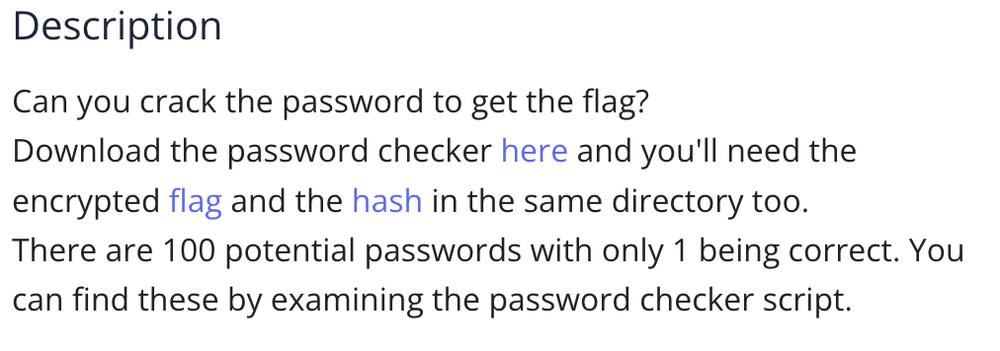

The `level4.py` file contains this:
```
import hashlib

### THIS FUNCTION WILL NOT HELP YOU FIND THE FLAG --LT ########################
def str_xor(secret, key):
    #extend key to secret length
    new_key = key
    i = 0
    while len(new_key) < len(secret):
        new_key = new_key + key[i]
        i = (i + 1) % len(key)        
    return "".join([chr(ord(secret_c) ^ ord(new_key_c)) for (secret_c,new_key_c) in zip(secret,new_key)])
###############################################################################

flag_enc = open('level4.flag.txt.enc', 'rb').read()
correct_pw_hash = open('level4.hash.bin', 'rb').read()

def hash_pw(pw_str):
    pw_bytes = bytearray()
    pw_bytes.extend(pw_str.encode())
    m = hashlib.md5()
    m.update(pw_bytes)
    return m.digest()

def level_4_pw_check():
    user_pw = input("Please enter correct password for flag: ")
    user_pw_hash = hash_pw(user_pw)
    
    if( user_pw_hash == correct_pw_hash ):
        print("Welcome back... your flag, user:")
        decryption = str_xor(flag_enc.decode(), user_pw)
        print(decryption)
        return
    print("That password is incorrect")

level_4_pw_check()

# The strings below are 100 possibilities for the correct password. 
#   (Only 1 is correct)
pos_pw_list = ["6288", "6152", "4c7a", "b722", "9a6e", "6717", "4389", "1a28", "37ac",...]
```
We have 100 passwords, so we cannot try every single one of them. What we can do instead, is create a for loop that iterates over all the potential passwords, and tries each of them until it gets to the right one, which then immediately returns the flag.
We modify `def level_4_pw_check()` as such
```
def level_4_pw_check():
    for i in range(0, len(pos_pw_list)):
        user_pw = pos_pw_list[i]
        user_pw_hash = hash_pw(user_pw)
        if( user_pw_hash == correct_pw_hash ):
            print("Welcome back... your flag, user:")
            decryption = str_xor(flag_enc.decode(), user_pw)
            print(decryption)
            return
    print("That password is incorrect")
```

Which gives us the flag:
FLag: `picoCTF{fl45h_5pr1ng1ng_ae0fb77c}`